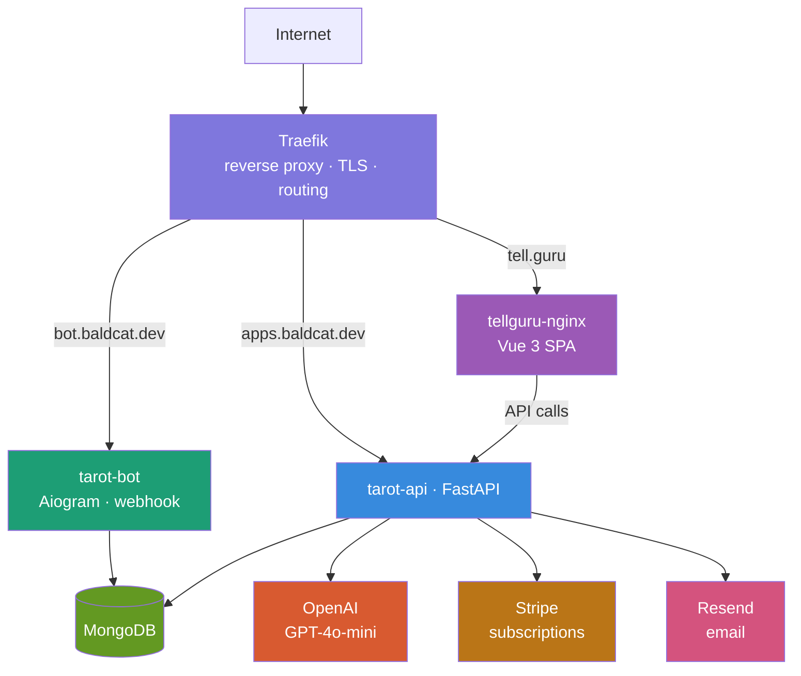

# 🐈‍⬛ baldcatdev

> 🔮 Live project: [tell.guru](https://tell.guru) — AI-powered tarot & rune readings via Telegram bot and web app.

---

## What is this?

A distributed app that delivers AI-generated tarot and rune readings across two platforms — a Telegram bot and a Vue 3 web app. Everything runs in Docker behind Traefik, with OpenAI doing the interpretations and Stripe handling subscriptions.

---

## Architecture

---

## Tech Stack

### Backend

### Frontend

### Bot

### Infrastructure

---

## Services

| Service | Domain | Description |
|---|---|---|
| `tarot-api` | `apps.baldcat.dev` | FastAPI backend — cards, users, Stripe, email |
| `tarot-bot` | `bot.baldcat.dev` | Telegram bot (webhook) |
| `tellguru-nginx` | `tell.guru` | Vue 3 SPA static files |
| `traefik` | — | Reverse proxy, TLS, routing |

---

## Highlights

- **Idempotent card draws** — MongoDB atomic `$setOnInsert` + in-memory lock prevents duplicate readings on double-tap
- **Telegram Mini App** — bot opens full card meaning pages as inline WebApp
- **Calendar-based daily card** — resets at midnight, not 24h from last use
- **Language-keyed cache** — card meanings cached per language in Pinia + localStorage
- **Honeypot spam protection** — contact form silently drops bot submissions

---

## Related

- 🌐 [tell.guru](https://tell.guru) — web app
- 🤖 [@Tarotelling_bot](https://t.me/Tarotelling_bot) — Telegram bot
